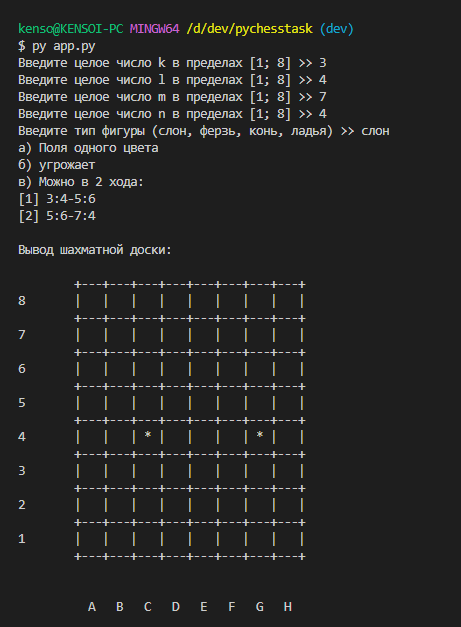
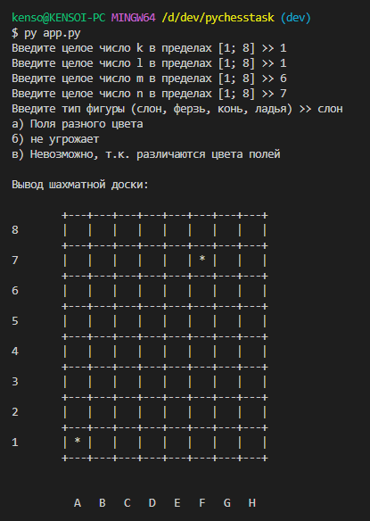
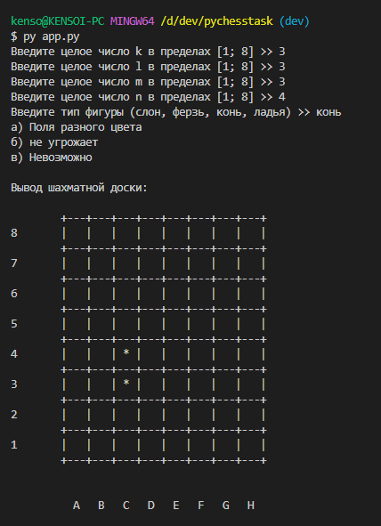

# Автор
Прокофьев Андрей Алексеевич

# Описание
Реализация лабораторной работы №7 по прикладному программированию

* app.py - основной функционал программы
* behaviors.py - поведение программы при выполнении заданий б/в в зависимости от выбранного типа фигуры
* chess.py - константы и классы связанные с шахматами
* utils.py - рабочие методы

# Запуск
Для запуска скриптов внутри репозитория требуется Python версии 3.10 и выше

## Запуск всей программы
```bash
python3 app.py
```

## Тест вывода шахматной доски с отмеченными точками
```bash
python3 chess.py
```

# Скриншоты


